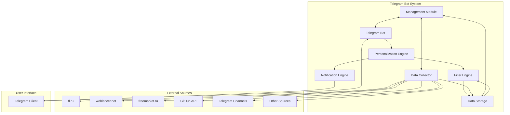

# Архитектурное решение для телеграм-бота по сбору и рассылке заказов и вакансий для фрилансеров

## 1. Общее описание системы

Система представляет собой телеграм-бота, который автоматически собирает, фильтрует и персонализированно рассылает актуальные заказы и вакансии для фрилансеров. Система использует только бесплатные, открытые и легальные источники, доступные в России.

## 2. Основные компоненты системы

### 2.1. Телеграм-бот (Telegram Bot)
- Взаимодействует с пользователями через Telegram API
- Обрабатывает команды и настройки фильтрации
- Отправляет уведомления о новых совпадениях

### 2.2. Модуль сбора данных (Data Collector)
- Сканирует различные источники (API, веб-сайты, телеграм-каналы)
- Извлекает информацию о заказах и вакансиях
- Нормализует данные в единый формат

### 2.3. Модуль фильтрации (Filter Engine)
- Применяет пользовательские фильтры к собранным данным
- Проверяет совпадения по ключевым словам, стеку технологий, бюджету, региону и срокам выполнения
- Поддерживает расширенные фильтры, включая уровень опыта, форму оплаты и сложные ключевые слова с логическими операторами

### 2.4. Модуль персонализации (Personalization Engine)
- Управляет профилями пользователей их предпочтениями
- Определяет релевантные заказы и вакансии для каждого пользователя

### 2.5. Модуль уведомлений (Notification Engine)
- Отправляет персонализированные уведомления пользователям
- Управляет расписанием рассылки

### 2.6. Слой хранения данных (Data Storage)
- Хранит профили пользователей
- Сохраняет собранные заказы и вакансии
- Обеспечивает быстрый доступ к данным для фильтрации

### 2.7. Модуль управления (Management Module)
- Мониторит состояние системы
- Обеспечивает логирование и аудит
- Управляет конфигурацией системы

## 3. Взаимодействие компонентов

```
[Пользователь Telegram] -> [Telegram Bot] -> [Personalization Engine] -> [Filter Engine] -> [Data Collector]
                                           -> [Notification Engine] -> [Data Storage]
                                           -> [Management Module]
```

## 4. Поддерживаемые источники данных

- fl.ru
- weblancer.net
- freemarket.ru
- GitHub API (для open-source проектов)
- Telegram-каналы (через Telegram API)
- Другие доступные легальные API и веб-сайты в РФ

## 5. Параметры фильтрации

- Ключевые слова
- Стек технологий
- Бюджет
- Регион
- Сроки выполнения
- Тип проекта (заказ/вакансия)
- Опыт исполнителя
- Форма оплаты
- Сложные ключевые слова с логическими операторами (И, ИЛИ, НЕ)

## 6. Архитектурные принципы

### 6.1. Масштабируемость
- Микросервисная архитектура для независимого масштабирования компонентов
- Использование очередей сообщений (например, RabbitMQ или Apache Kafka) для асинхронной обработки
- Горизонтальное масштабирование модуля сбора данных для обработки большого количества источников

### 6.2. Отказоустойчивость
- Резервное копирование данных
- Использование кластеров баз данных
- Мониторинг состояния компонентов
- Автоматическое восстановление после сбоев
- Резервные экземпляры критических сервисов

### 6.3. Безопасность
- Шифрование конфиденциальных данных
- Аутентификация и авторизация
- Защита от DDoS-атак
- Соблюдение требований законодательства РФ

## 7. Технологии и инструменты

### 7.1. Backend
- Python (Django/Flask или FastAPI) или Node.js
- PostgreSQL или MongoDB для хранения данных
- Redis для кэширования
- Celery или аналог для фоновых задач

### 7.2. Frontend
- Telegram Bot API
- Возможность веб-интерфейса для настройки фильтров

### 7.3. Инфраструктура
- Docker для контейнеризации
- Kubernetes для оркестрации
- Nginx как обратный прокси-сервер
- ELK Stack (Elasticsearch, Logstash, Kibana) для логирования

## 8. Соответствие требованиям законодательства РФ

### 8.1. Обработка персональных данных
- Хранение персональных данных на серверах, расположенных в РФ
- Шифрование персональных данных
- Получение согласия пользователей на обработку данных
- Реализация права на удаление персональных данных
- Ведение журнала доступа к персональным данным

### 8.2. Соответствие ФЗ-152
- Минимизация объема собираемых персональных данных
- Обеспечение целевой направленности сбора данных
- Обеспечение точности и актуальности персональных данных
- Ограничение срока хранения персональных данных

## 9. Диаграмма архитектуры



## 10. План развертывания

### 10.1. Этап 1: Подготовка инфраструктуры
- Настройка серверов в РФ
- Установка Docker и Kubernetes
- Настройка базы данных и системы хранения

### 10.2. Этап 2: Разработка и тестирование
- Разработка модулей системы
- Интеграционное тестирование
- Тестирование безопасности

### 10.3. Этап 3: Развертывание
- Развертывание в тестовой среде
- Пилотная эксплуатация
- Развертывание в продакшене

### 10.4. Этап 4: Мониторинг и поддержка
- Внедрение системы мониторинга
- Обеспечение технической поддержки
- Постоянное обновление источников данных

## 11. Риски и меры по их минимизации

### 11.1. Технические риски
- Блокировка доступа к источникам данных
- Перегрузка системы при большом количестве пользователей
- Потеря данных из-за сбоев оборудования

### 11.2. Правовые риски
- Изменение законодательства в области обработки персональных данных
- Запрет на использование определенных источников данных

### 11.3. Меры по минимизации
- Использование нескольких альтернативных источников
- Регулярное резервное копирование данных
- Постоянный мониторинг изменений в законодательстве
- Гибкая архитектура для быстрого реагирования на изменения

## 12. Модули источников данных

### 12.1. Модуль fl.ru (src/data_sources/fl_ru_collector.py)
- Поддерживает получение данных через RSS и веб-скрапинг
- Реализует нормализацию данных к единому формату
- Поддерживает фильтрацию на уровне источника

### 12.2. Модуль weblancer.net (src/data_sources/weblancer_collector.py)
- Поддерживает получение данных через RSS и веб-скрапинг
- Реализует нормализацию данных к единому формату
- Поддерживает фильтрацию на уровне источника

### 12.3. Модуль freemarket.ru (src/data_sources/freemarket_collector.py)
- Поддерживает получение данных через веб-скрапинг
- Реализует нормализацию данных к единому формату
- Поддерживает фильтрацию на уровне источника

### 12.4. Модуль GitHub API (src/data_sources/github_collector.py)
- Поддерживает получение данных через GitHub API
- Реализует поиск репозиториев и задач (issues)
- Реализует нормализацию данных к единому формату

### 12.5. Модуль Telegram-каналов (src/data_sources/telegram_collector.py)
- Поддерживает мониторинг публичных и приватных каналов
- Реализует получение сообщений с использованием Telegram API
- Реализует нормализацию данных к единому формату