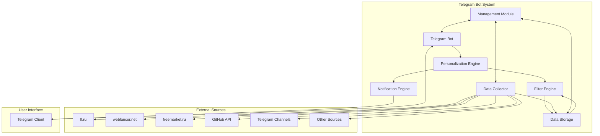

# Общая документация для телеграм-бота для фрилансеров

## Обзор проекта

Телеграм-бот для фрилансеров - это автоматизированная система, которая собирает, фильтрует и персонализированно рассылает актуальные заказы и вакансии для фрилансеров. Система использует только бесплатные, открытые и легальные источники, доступные в России.

### Основные компоненты

1. **Telegram Bot** - взаимодействует с пользователями через Telegram API
2. **Data Collector** - сканирует различные источники и извлекает информацию
3. **Filter Engine** - применяет пользовательские фильтры к собранным данным
4. **Personalization Engine** - управляет профилями пользователей и определяет релевантные заказы
5. **Notification Engine** - отправляет персонализированные уведомления пользователям
6. **Data Storage** - хранит профили пользователей и собранные данные
7. **Management Module** - мониторит состояние системы и обеспечивает логирование

### Поддерживаемые источники данных

- fl.ru
- weblancer.net
- freemarket.ru
- GitHub API (для open-source проектов)
- Telegram-каналы (через Telegram API)
- Другие доступные легальные API и веб-сайты в РФ

## Установка и запуск

Для установки и запуска системы следуйте инструкциям в [руководстве по установке](installation_guide.md).

### Системные требования

- Python 3.8 или выше
- pip (менеджер пакетов Python)
- Git (для клонирования репозитория)
- Telegram Bot Token (получается у @BotFather в Telegram)

### Быстрый старт

1. Клонируйте репозиторий
2. Создайте виртуальное окружение
3. Установите зависимости
4. Настройте конфигурацию
5. Запустите бота

## API и интерфейсы

Для ознакомления с API системы см. [описание API](api_documentation.md).

### Команды бота

- `/start` - начать работу с ботом
- `/help` - справка по использованию
- `/settings` - настройка профиля и предпочтений
- `/filter` - настройка фильтров поиска
- `/subscribe` - подписаться на рассылку
- `/unsubscribe` - отписаться от рассылки
- `/add_keywords` - добавить ключевые слова
- `/remove_keywords` - удалить ключевые слова
- `/add_tech` - добавить технологии
- `/remove_tech` - удалить технологии
- `/set_budget` - установить бюджет
- `/set_region` - установить регион
- `/set_project_type` - установить тип проекта
- `/set_experience` - установить уровень опыта
- `/set_payment_type` - установить форму оплаты

## Конфигурация

Для настройки системы см. [инструкции по конфигурации](configuration_guide.md).

### Основные параметры

- `TELEGRAM_BOT_TOKEN` - токен вашего Telegram бота
- `DATABASE_PATH` - путь к файлу базы данных SQLite
- `LOG_LEVEL` - уровень логирования
- `SYSTEM_CONFIG` - дополнительные настройки системы

## Масштабирование и отказоустойчивость

Для информации о масштабировании и обеспечении отказоустойчивости см. [план масштабирования](scaling_and_fault_tolerance_plan.md).

### Архитектурные принципы

- Микросервисная архитектура для независимого масштабирования компонентов
- Использование очередей сообщений для асинхронной обработки
- Горизонтальное масштабирование модуля сбора данных
- Репликация базы данных для обеспечения доступности

## Соответствие требованиям законодательства РФ

Для информации о соответствии требованиям законодательства РФ см. [стратегию соответствия](compliance_strategy.md).

### Основные требования

- Хранение персональных данных на серверах, расположенных в РФ
- Шифрование персональных данных
- Получение согласия пользователей на обработку данных
- Реализация права на удаление персональных данных
- Ведение журнала доступа к персональным данным

## Docker-контейнеры

Для информации о контейнеризации см. [Docker-контейнеры](docker_containers.md).

### Структура контейнеров

- `bot` - основной сервис бота
- `db` - база данных PostgreSQL
- `redis` - кэш данных
- `nginx` - веб-сервер (опционально)

## CI/CD pipeline

Для информации о процессе непрерывной интеграции и доставки см. [CI/CD pipeline](ci_cd_pipeline.md).

### Этапы pipeline

1. Инициализация
2. Сборка
3. Тестирование
4. Сборка Docker образа
5. Развертывание

## Развертывание в облаке

Для информации о развертывании в облаке см. [схему развертывания в Yandex Cloud](cloud_deployment_scheme.md).

### Компоненты архитектуры

- Cloud Load Balancer
- Managed Service for Kubernetes
- Managed Service for PostgreSQL
- Managed Service for Redis
- Object Storage
- Cloud CDN
- Cloud Monitoring
- Cloud Logging

## Мониторинг и логирование

Для информации о мониторинге и логировании см. [план мониторинга и логирования](monitoring_and_logging_plan.md).

### Стек технологий

- Prometheus - сбор и хранение метрик
- Grafana - визуализация метрик
- ELK/EFK Stack - логирование
- Alertmanager - управление алертами

## Архитектурные решения

Для детального ознакомления с архитектурными решениями см. [архитектурную документацию](architecture_documentation.md).

### Диаграмма архитектуры

## Технологии и инструменты

### Backend
- Python (с использованием асинхронных фреймворков)
- PostgreSQL или MongoDB для хранения данных
- Redis для кэширования
- Celery или аналог для фоновых задач

### Frontend
- Telegram Bot API
- Возможность веб-интерфейса для настройки фильтров

### Инфраструктура
- Docker для контейнеризации
- Kubernetes для оркестрации
- Nginx как обратный прокси-сервер
- ELK Stack (Elasticsearch, Logstash, Kibana) для логирования

## Планы развития

### Краткосрочные планы
- Улучшение алгоритмов персонализации
- Добавление новых источников данных
- Оптимизация производительности

### Долгосрочные планы
- Внедрение машинного обучения для улучшения рекомендаций
- Расширение функциональности для работодателей
- Интеграция с дополнительными платформами

## Заключение

Телеграм-бот для фрилансеров представляет собой комплексное решение для автоматического сбора, фильтрации и персонализированной рассылки актуальных заказов и вакансий. Система спроектирована с учетом требований масштабируемости, отказоустойчивости и соответствия законодательству РФ.